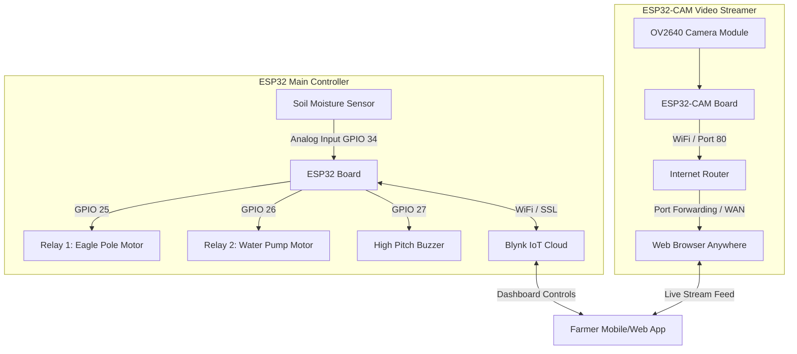
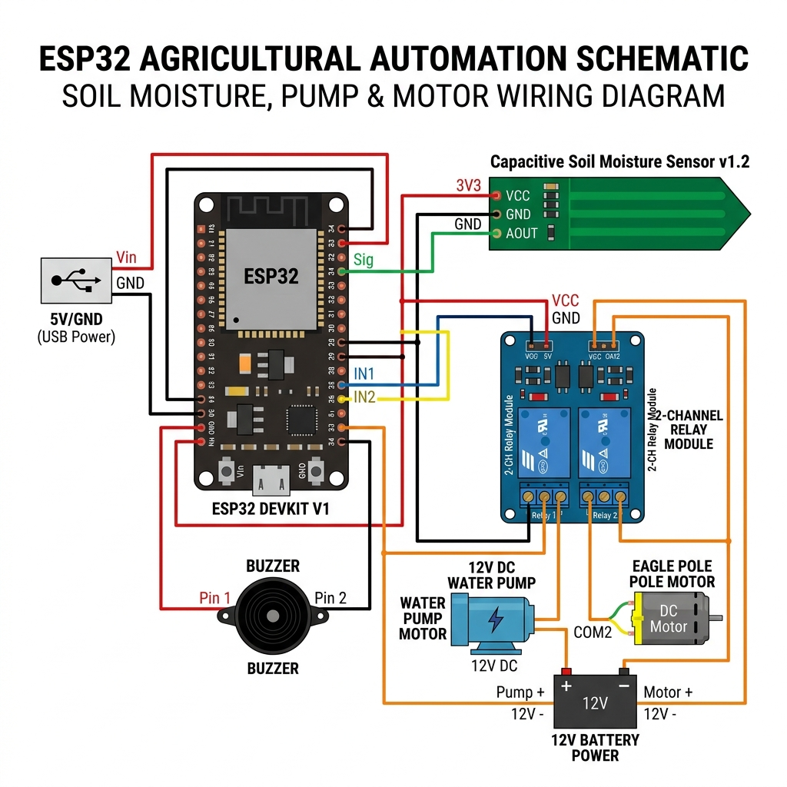

# IoT Eagle Scarecrow and Smart Agricultural Monitoring System

An automated, IoT-enabled crop protection and smart irrigation system. This project uses two ESP32 microcontrollers to deter birds from devouring crops, monitor soil moisture levels, trigger alerts via email, and provide a live visual camera feed of the field from anywhere.

---

## Table of Contents
1. [Introduction & Farming Significance](#1-introduction--farming-significance)
2. [System Architecture](#2-system-architecture)
3. [Hardware Connections (Pin Map)](#3-hardware-connections-pin-map)
4. [Blynk Setup & Configuration](#4-blynk-setup--configuration)
5. [Setting Up Blynk Email Alerts & Notifications](#5-setting-up-blynk-email-alerts--notifications)
6. [ESP32-CAM: Streaming Live Anywhere](#6-esp32-cam-streaming-live-anywhere)
7. [Installation & Upload Guide](#7-installation--upload-guide)

---

## 1. Introduction & Farming Significance

In traditional farming, manual bird scaring and manual soil-watering schedules demand significant labor, time, and are often inefficient. This system addresses these issues in three key ways:

*   **Rotating Eagle Scarecrow (Relay 1 Control)**: Birds like pigeons, crows, and sparrows are a major threat to crops, especially during the seeding and grain-eating stages. This system controls a rotating pole equipped with two realistic eagle models. By activating a high-velocity fan/motor via a relay, the eagles rotate dynamically. To pests, this movement simulates a bird of prey descending on the field, trigger their flight response.
*   **Acoustic Deterrence (Buzzer Control)**: When birds grow accustomed to physical movement, an audio alarm serves as an additional deterrent. The Blynk app features a manual buzzer button to trigger high-pitch sound alerts, instantly scaring birds away.
*   **Smart Soil Moisture Monitoring & Irrigation (Relay 2 Control)**: Over-watering or under-watering directly damages crop yield. The capacitive/resistive soil moisture sensor tracks soil dryness. If the moisture levels dip below a configurable threshold, the system notifies the farmer. The water pump motor can then be remotely activated via a Blynk switch.
*   **Live Camera Monitoring**: The ESP32-CAM streams live video, allowing farmers to visually inspect the field, verify that the eagle scarecrow is rotating, monitor the water pump flow, and look out for intruders or pests from anywhere.

---

## 2. System Architecture

The project splits functionality across two boards for maximum hardware stability:



---

## 3. Hardware Connections (Pin Map)

### 3.1 Main ESP32 Pin Connections

| Component | ESP32 Pin | Wire Type | Details |
| :--- | :---: | :---: | :--- |
| **Soil Moisture Sensor (VCC)** | `3V3` | Power | Connects to 3.3V out on ESP32 |
| **Soil Moisture Sensor (GND)** | `GND` | Ground | Common ground |
| **Soil Moisture Sensor (SIG)** | `GPIO 34` | Analog Input | Reads values (0 to 4095) |
| **Eagle Pole Relay (IN)** | `GPIO 25` | Digital Output | Trigger for Eagle Rotation Fan/Motor |
| **Water Pump Relay (IN)** | `GPIO 26` | Digital Output | Trigger for Water Pump Motor |
| **Buzzer (Positive)** | `GPIO 27` | Digital Output | Active buzzer output |
| **Buzzer (Negative)** | `GND` | Ground | Common ground |

#### Circuit Diagram



> [!NOTE]
> Verify if your relay boards are **Active-LOW** or **Active-HIGH**. The code assumes Active-HIGH (relays turn on when pin is set to `HIGH`). If yours is Active-LOW, change `digitalWrite(pin, HIGH)` logic to `LOW` in the code, or configure it accordingly in your wiring.

---

### 3.2 ESP32-CAM Programming Pin Map (FTDI Board)

Since the ESP32-CAM does not feature an onboard USB-to-UART converter, you must use an external FTDI USB-to-Serial board to program it.

| FTDI Adapter Pin | ESP32-CAM Pin | Details |
| :--- | :---: | :--- |
| **VCC (5V)** | `5V` | ESP32-CAM requires 5V power input |
| **GND** | `GND` | Connect common ground |
| **TX** | `U0R (RX)` | Cross connections: TX to RX |
| **RX** | `U0T (TX)` | Cross connections: RX to TX |
| **-** | **`GPIO 0` to `GND`** | **CRITICAL:** Short these pins to enter upload mode. Disconnect after uploading. |

---

## 4. Blynk Setup & Configuration

To control the system via Blynk, you must configure a template in the [Blynk IoT Console](https://blynk.cloud/).

### 4.1 Creating the Template
1. Log into your Blynk Developer account and click **Templates** -> **Create New Template**.
2. Name it `Eagle Scarecrow System` and set the hardware to **ESP32**, connection type to **WiFi**.

### 4.2 Configuring Datastreams
Create the following **Virtual Pin** Datastreams:

| Pin | Name | Data Type | Min | Max | Default | Widget Type | Description |
| :---: | :--- | :---: | :---: | :---: | :---: | :---: | :--- |
| **V1** | Eagle Pole Switch | Integer | `0` | `1` | `0` | Switch | Turns Eagle rotating motor on/off |
| **V2** | Water Pump Switch | Integer | `0` | `1` | `0` | Switch | Turns irrigation motor on/off |
| **V3** | Soil Moisture | Integer | `0` | `100` | `0` | Gauge / Label | Displays current soil moisture % |
| **V4** | Buzzer Scare | Integer | `0` | `1` | `0` | Button / Switch | Triggers audio buzzer sound |
| **V5** | Dry Threshold | Integer | `0` | `100` | `30` | Slider | Sets threshold below which alert triggers |

### 4.3 Building the Dashboard
In **Web Dashboard** (or Blynk Mobile App):
*   Add two **Switch** widgets and map them to `V1` (Eagle) and `V2` (Pump).
*   Add a **Gauge** widget and map it to `V3` (Soil Moisture).
*   Add a **Button** widget (set to Push or Switch mode) and map it to `V4` (Buzzer).
*   Add a **Slider** widget and map it to `V5` (Dry Threshold, range 0 to 100).

---

## 5. Setting Up Blynk Email Alerts & Notifications

To receive automatic email alerts when the soil moisture levels drop below your custom threshold:

1. In the Blynk Console, go to your **Template settings** and select the **Events** tab.
2. Click **Add New Event**.
3. Fill out the event details:
    *   **Event Name**: `Low Soil Moisture Alert`
    *   **Event Code**: `low_soil_moisture` *(This must exactly match the name in `Blynk.logEvent("low_soil_moisture", ...)`)*
    *   **Type**: `Warning`
4. Go to the **Notifications** tab inside that event configurations:
    *   Enable **Send Event notifications to Active Users**.
    *   Choose **Email** (and/or **Push Notifications** on your mobile device).
    *   Set the email subject, e.g., `[Blynk Alert] Dry Soil Detected in Field!`.
    *   Save and publish the changes.
5. In the sketch, if soil moisture drops below the threshold set on Virtual Pin V5, `Blynk.logEvent()` executes. Blynk will immediately route this event and send an email alert to your registered Blynk account.

---

## 6. ESP32-CAM: Streaming Live Anywhere

The ESP32-CAM functions as an independent MJPEG (Motion JPEG) video web server. 

### 6.1 Accessing the Stream Locally
After upload, open the Arduino IDE Serial Monitor (115200 baud). The board will display the Local IP address:
```text
WiFi connected!
Starting camera stream server on port: '80'
Camera Stream URL: http://192.168.1.15/
```
To view the stream, type `http://192.168.1.15/` into any web browser connected to the same Wi-Fi network.

### 6.2 Monitoring Globally (From Anywhere)
To access this live feed from outside your local network (e.g., when you are in the city and the system is in your remote field), you can choose one of the following methods:

#### Method A: Router Port Forwarding (Standard & Free)
This method exposes the ESP32-CAM stream port directly to the internet through your network router.
1. **Assign a Static IP**: Access your router setup page (typically `192.168.1.1`) and bind a static IP (e.g., `192.168.1.15`) to the MAC address of your ESP32-CAM.
2. **Configure Port Forwarding**:
    *   In your router configurations, look for **Port Forwarding**, **Virtual Server**, or **NAT** settings.
    *   Add a new rule:
        *   **External Port**: e.g., `8080` (or `80`)
        *   **Internal Port**: `80`
        *   **Internal IP**: `192.168.1.15` (Your ESP32-CAM static IP)
        *   **Protocol**: `TCP`
3. **Find your Public WAN IP**: Visit a site like [whatsmyip.org](https://whatsmyip.org) to obtain your home network's external IP (e.g., `49.206.120.35`).
4. **Access the Camera**: You can now view the camera feed from any device globally by navigating to:
   `http://49.206.120.35:8080/`

> [!WARNING]
> Most home internet service providers (ISPs) change your WAN IP address periodically (Dynamic IP). If your WAN IP changes, your external URL will stop working. To fix this, configure a free **DDNS** (Dynamic DNS) service like No-IP or DuckDNS inside your router.

#### Method B: Tunneling via Ngrok (No Router Configuration Needed)
If you cannot configure your router's port forwarding settings, you can use a tunneling utility like **Ngrok** on a computer connected to the same network:
1. Download and run Ngrok on your local PC.
2. Expose the ESP32-CAM port using the terminal command:
   `ngrok http http://192.168.1.15:80`
3. Ngrok will output a secure public URL (e.g., `https://a1b2-34-56-78.ngrok-free.app`). 
4. You can use this URL to view the live camera feed from anywhere globally.

---

## 7. Installation & Upload Guide

1.  **Install Arduino IDE**: Make sure you have the Arduino IDE installed.
2.  **Add ESP32 Board Support**:
    *   Go to **File** -> **Preferences**.
    *   Add this URL to the *Additional Boards Manager URLs*:
        `https://raw.githubusercontent.com/espressif/arduino-esp32/gh-pages/package_esp32_index.json`
    *   Go to **Tools** -> **Board** -> **Boards Manager**, search for `esp32` by Espressif, and click **Install**.
3.  **Install Blynk Library**:
    *   Go to **Sketch** -> **Include Library** -> **Manage Libraries**.
    *   Search for `Blynk` and install the latest version.
4.  **Upload the Codes**:
    *   Open `main_controller/main_controller.ino`. Put in your Blynk credentials (Template ID, Auth Token) and WiFi settings. Select your ESP32 board model (e.g., `ESP32 Dev Module`) and target port, then click **Upload**.
    *   Open `camera_streamer/camera_streamer.ino`. Update your WiFi credentials. Select your ESP32 board model as **`AI Thinker ESP32-CAM`**. Short `GPIO 0` to `GND`, hit **Upload**, then disconnect the short and hit the reset button to start the stream server.
